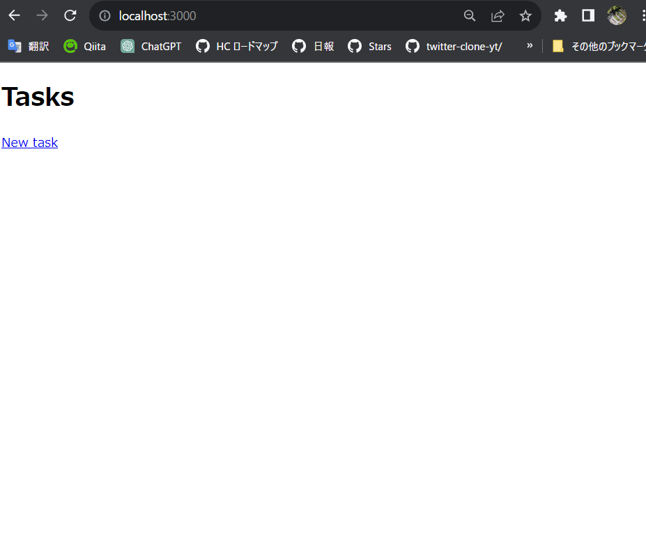

# 本ソースコードをDocker化するための手順
https://github.com/okuyama-code/rails-docker
```
cd ~/dev/happiness/rails-docker && code .
```

## 1.以下のURLからテンプレートを自分のリポジトリにも作る
https://github.com/ihatov08/rails7_docker_template

Use this templateボタンを押しでCreate a new repositoryを選択し、自分のアカウント配下にリポジトリを作成。rails-dockerという名前のリポジトリにする。

## 2. git cloneしてテンプレートを確認
クローンしたいディレクトリに移動
```
cd ~/dev/happiness/ && ls
```
```
git clone https://github.com/okuyama-code/rails-docker.git
```
```
 cd rails-docker/
 code .
```
サーバーを起動する(自分の場合bashではなくpawershell)
```
bundle install
rails s
```
```
ActiveRecord::ConnectionNotEstablished
connection to server at "localhost" (::1), port 5432 failed: fe_sendauth: no password supplied
```
このエラーが出るということはサーバーがたてられている。

## dokerブランチの作成し移動
```
git checkout -b docker
```
## 3.docker化していく
Dockerfile作成
```Dockerfile
FROM ruby:3.2.2
RUN apt-get update -qq && apt-get install -y \
  build-essential \
  libpq-dev \
  nodejs \
  postgresql-client \
  yarn
WORKDIR /rails-docker
COPY Gemfile Gemfile.lock /rails-docker/
RUN bundle install
```

Docker-compose.yml作成

```Dockerfile
version: "3.9"

volumes:
  db-data:

services:
  web:
    build: .
    ports:
      - '3000:3000'
    volumes:
      - '.:/rails-docker'
    environment:
      - 'DATABASE_PASSWORD=postgres'
    tty: true
    stdin_open: true
    depends_on:
      - db
    links:
      - db

  db:
    image: postgres:12
    volumes:
      - 'db-data:/var/lib/postgresql/data'
    environment:
      - 'POSTGRES_USER=postgres'
      - 'POSTGRES_PASSWORD=postgres'

```

config/database.yml修正
```
docker-compose build
```

```
docker-compose run web rake db:create db:migrate
```

```
docker-compose up
```

Dockerアプリを起動しコマンド入力
```
docker-compose up -d
```

```
$ docker-compose up -d
[+] Building 0.0s (0/0)
[+] Running 3/3
 ✔ Network rails-docker_default  Created               0.0s
 ✔ Container rails-docker-db-1   Started               0.6s
 ✔ Container rails-docker-web-1  Started               1.1s
```
```
docker-compose exec web bash
```
ここからはコンテナ内(root@abf1c533024c:/rails-docker#)
```
rails db:create
```
```
rails db:migrate
```
サーバーにアクセスできなかったためCMDを追記
```Dockerfile
FROM ruby:3.2.2
RUN apt-get update -qq && apt-get install -y \
  build-essential \
  libpq-dev \
  nodejs \
  postgresql-client \
  yarn
WORKDIR /rails-docker
COPY Gemfile Gemfile.lock /rails-docker/
RUN bundle install
CMD rails s -p 3000 -b '0.0.0.0' //追記
```
```
rails s -p 3000 -b '0.0.0.0'
```
成功



## rails sができないときの対処法その2　docker-compose.ymlにcommandを追記
この場合はDockefileのCMD rails s -p 3000 -b '0.0.0.0'いらない。
```Dockerfile
version: "3.9"

# Docker Composeで使用するボリュームを定義します。
volumes:
  db-data:  # db-dataという名前のボリュームを作成します。

# サービスを定義します。
services:

  # Webサービス
  web:
    build: .  # カレントディレクトリからのビルドを指定します。
    command: bundle exec rails s -p 3000 -b '0.0.0.0'  # Railsサーバーの起動コマンドを指定します。
    ports:
      - '3000:3000'  # ホストマシンのポート3000とコンテナのポート3000をマッピングします。
    volumes:
      - '.:/rails-docker'  # ホストマシンのカレントディレクトリをコンテナの/rails-dockerにマウントします。
    environment:
      - 'DATABASE_PASSWORD=postgres'  # データベースのパスワードを環境変数として設定します。
    tty: true
    stdin_open: true
    depends_on:
      - db  # dbサービスが起動するまで待機します。

  # データベースサービス
  db:
    image: postgres:12  # PostgreSQL 12の公式イメージを使用します。
    volumes:
      - 'db-data:/var/lib/postgresql/data'  # データベースのデータを永続化するためのボリュームをマウントします。
    environment:
      - 'POSTGRES_USER=postgres'  # PostgreSQLのユーザー名を設定します。
      - 'POSTGRES_PASSWORD=postgres'  # PostgreSQLのパスワードを設定します

```
### 注意
docker-compose.ymlが正解。Docker-compose.ymlではgithub actionsでエラーになる

### 参考

```
$ docker-compose exec web bash
root@abf1c533024c:/rails-docker# rails db:create
/usr/local/bin/ruby: warning: shebang line ending with \r may cause problems
Created database 'rails_docker_development'
Created database 'rails_docker_test'
root@abf1c533024c:/rails-docker#
```
このメッセージは、Railsアプリケーション内でデータベースを作成するために実行されたコマンド rails db:create の結果を示しています。この結果に含まれる2つの行について説明します。

/usr/local/bin/ruby: warning: shebang line ending with \r may cause problems:
この行は、/usr/local/bin/rubyという場所にインストールされたRuby実行可能ファイルを使用していることを示しています。そして、このファイルのshebang行（#!/usr/local/bin/rubyのような行）の終了が\rであることに警告しています。\rは、通常はUNIXベースのシステムで使用される改行文字ではなく、Windowsシステムで使用される改行文字です。この警告は、改行文字が誤って設定されている可能性があり、一部のシステムで問題を引き起こす可能性があることを示唆しています。通常、UNIX系のシステムでは改行文字として\nを使用します。しかし、この警告自体はRailsのデータベース作成には直接関係ありません。

Created database 'rails_docker_development' および Created database 'rails_docker_test':
これらの行は、データベースが正常に作成されたことを示しています。Railsアプリケーションは、開発環境とテスト環境用にそれぞれデータベースを作成しました。データベースの名前は rails_docker_development（開発環境用）および rails_docker_test（テスト環境用）です。これらのデータベースは、Railsアプリケーションのデータの格納と操作に使用されます。

簡単に言えば、このメッセージは、Railsアプリケーションがデータベースを正常に作成したことと、Ruby実行可能ファイルのshebang行に関する警告を示しています。データベースの作成に成功したため、Railsアプリケーションはデータベースを使用してデータを格納および管理できるようになりました。
